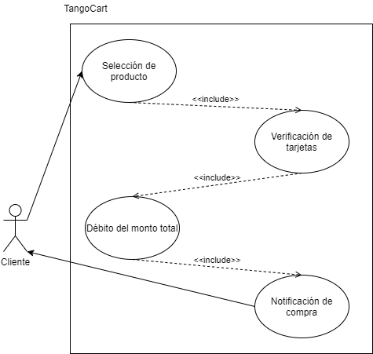

# Tangocart
Is a university project which proposes the use of different technologies to create an online store, capable of manage a large number of concurrent requests from users. For this project the technologies used for infraestructure where: Cloud providers such as AWS, GCP and Heroku. Tools like Jenkins, Ansible, Terraform, Kubernetes and Docker, among programming languages such as Nodejs, Typescript, Html, Css, with the use of jwt and bash configuration files.

## Proposed solution

Tango Cart is an electronic commerce platform that allows users from Guatemala and soon, from the world to offer products that they wish to sell. These types of users are identified as suppliers. Customer-type users are those who have access to all the products offered by suppliers. Users can see the details of the products, add them to the shopping cart and buy what they want.

Tango Cart allows people interested in buying and selling products to have an easy and fast way to buy and sell products. Speeding up the economy, especially in times of little physical interaction between people due to the COVID-19 pandemic, being an excellent alternative to create new businesses and satisfy customer needs.

The current solution deals with a web application, which interacts with the user through the browser. This implementation allows the client to access the application through any device that has a browser installed.

## Architecture

Developers upload every change they make to the Github repository. Jenkins will detect those changes and depending on the branch nomenclature, will generate the Docker images and tell the Kubernetes cluster to update the current microservices, or build the Angular app and deploy it to a secondary repository that has configured to serve the code via Github Pages.

The Kubernetes cluster is created with Terraform, and the microservices deployed to the cluster using Ansible. Once the app is deployed, in case a user wants to deploy an image, the services will upload said image to a S3 bucket. During all this data flow, the services and app uses Nodejs and JWT for the backend, Angular and Typescript for the front end, and a MongoDb database.

## Use cases

[Login](https://www.notion.so/e118e7be783940d787898abeca66ea42)

[Register Products](https://www.notion.so/c275fba60c944573812dd43a710d9398)

[Modify profile](https://www.notion.so/29da0f5c26394d10bfc886bebbb7d3f4)

[Check orders placed](https://www.notion.so/e52d42e383fe4fdb8c1761bdf7e054cb)

[Check orders received](https://www.notion.so/c1bb38f6b8bf4f389b115e5c80368b6e)

[Add products to cart](https://www.notion.so/325470b9978c44e3b01efb05dd2ff620)

[Buy Products](https://www.notion.so/74b20d41d8e4499e881253dc51525f3b)

## Flowchart

Login to the system

Purchase from the user

## Microservices Identified

- Register Client
- Register Suppliers
- Register categories
- Register Products
- Login
- Modify User
- Add credit card

## Task Management

Trello was used for task management, a tool in which a task board was managed to work the Kanban methodology,

This board contains the following tables:

- Backlog: list of all tasks.
- To-Do: list of tasks to be done.
- In progress: list of tasks in progress.
- QA: list of tasks ready for review and testing.
- Done: list of completed tasks.

Week 1:

Week 2:

Week 3:

Week 4:

## Version handling

Github was used for version management, with the gitflow flow methodology.

**Github** is a Git-based collaborative software development and version control web service. In addition to a repository manager, the service also offers wiki hosting and a bug tracking system, all released under an Open Source License.

Gitflow is ideal for projects that have a scheduled release cycle, as well as the DevOps best practice of continuous delivery. This workflow does not add any new concepts or commands, other than those needed for the branching workflow. What it does is assign very specific functions to the different branches and define how and when they should interact. In addition to feature branches, use individual branches to prepare, maintain, and register releases. Of course, you also get all the benefits of the feature branch workflow: pull requests, isolated experiments, and more efficient collaboration.

Branches:

## Methodology tools to use

### Kanban:

Kanban is defined as a highly effective and efficient production system. The purpose of Kanban is to generally manage how tasks are completed. Kanban is a Japanese word that means “visual cards”.

The application of the Kanban method implies the generation of a task board that will improve the workflow and achieve a sustainable rate.

## Frontend and Backend Tools

## Front end:

### Angular:

## Backend:

### Node.js:

## Description of the functionality
### User Stories
- As a customer I want to create an account in the system
- As a supplier I want to create an account in the system
- As a customer I want to log in to the system with my registration data
- As a supplier I want to log in to the system with my registration data
- As a customer I want to confirm the purchase of the products that I have in the cart by paying them with my registered cards
- As a customer I want to receive notifications to my email when I confirm a purchase
- As a supplier I want to receive notifications when the stock of any of my products reaches 0
- As a customer I want to see the product catalog
- As a client I want to filter the catalog by category
- As a customer I want to add a product to the shopping cart of the
- As a supplier I want to add a product to the product catalog
- As a supplier I want to modify a product from the product catalog
- As a supplier I want to remove a product from the product catalog
- As a customer I want to put products for sale
- As a client I want to auction products
- As a customer I want to buy products instantly
- As a customer I want to add products to my favorites list
- As a customer I want to obtain a pdf invoice at the end of my purchase
- As a supplier I want to auction products

## Use Case Diagrams
### Buy now

Detail:

### Bid in auction

Detail:

## Flowcharts
### Buy now

### Bid in auction
